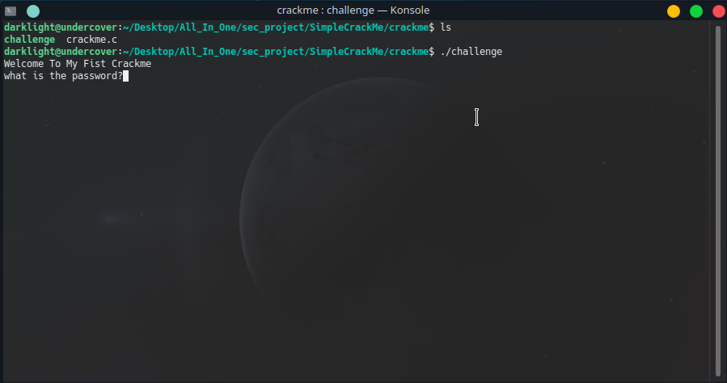

# simplecrackme
Simple Crackme Write in C Language.


Never Ever Open The source code(crackme.c) before solve the challange!!

## Installation

No Need Install anything just download the code and output File Directly or Use GIT

```bash
git clone https://github.com/saeidshirazi97/simplecrackme
```

## Usage


## Notes
I Recommend this walkthrough:

1-Use File commends to get information about challange file.

2-Use Strings Command.

3-Use Hexdump Command.

4-Use OBJDUMP

5-Bypass With NOP operation with dd tools and overwrite challange file
